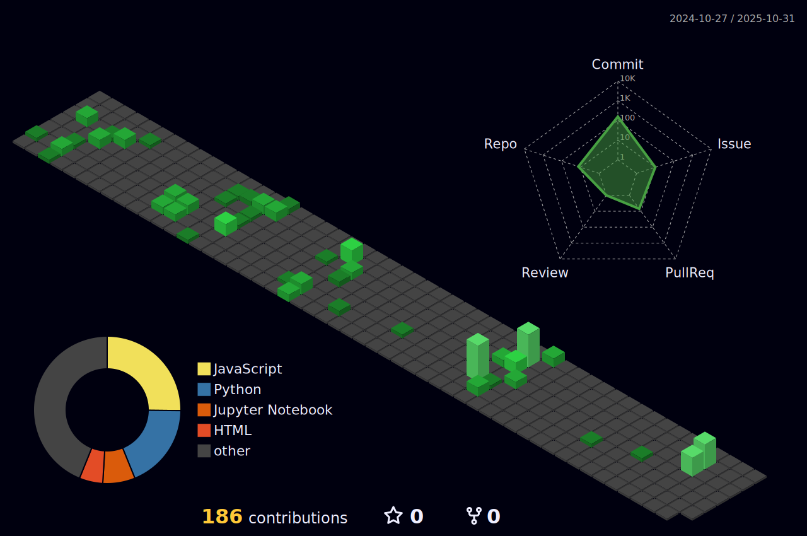

<div align="center">


<br>


<br>

<p align="center">
  <a href="#portfolio">
    
  </a>
  <a href="mailto:contact@example.com">
    
  </a>
  <a href="#linkedin">
    
  </a>
</p>


</div>

<br>

## Tech Stack

<div align="center">

<table>
<tr>
<td align="center" width="50%">

### AI/ML & Deep Learning

<p align="center">
  
  
</p>
<p align="center">
  
  
</p>
<p align="center">
  
  
</p>

</td>
<td align="center" width="50%">

### Development & Tools

<p align="center">
  
  
</p>
<p align="center">
  
  
</p>
<p align="center">
  
  
</p>

</td>
</tr>
</table>

<p align="center">
  
  
  
  
</p>

</div>


<br>

## GitHub Stats

<div align="center">

<table>
<tr>
<td align="center" width="50%">


</td>
<td align="center" width="50%">


</td>
</tr>
</table>


<br>


</div>


<br>

## Activity Visualization

<div align="center">

### Contribution Snake


<br>

### 3D Contribution Profile


<br>

### Skills Progress

```yaml
AI/ML Skills:
  Deep Learning: ████████████████████ 95%
  Computer Vision: ███████████████████░ 90%
  PyTorch: ████████████████████ 95%
  Python: █████████████████████ 100%

Development:
  Algorithm Design: ████████████████░░░░ 80%
  System Architecture: ███████████░░░░░░░░░ 75%
  Database Design: ██████████████░░░░░░ 70%
  DevOps: ███████████░░░░░░░░░ 60%
```

</div>


<br>

## Profile Analytics

<div align="center">


<br>

<p align="center">
  
  
</p>

</div>


<div align="center">


</div>
