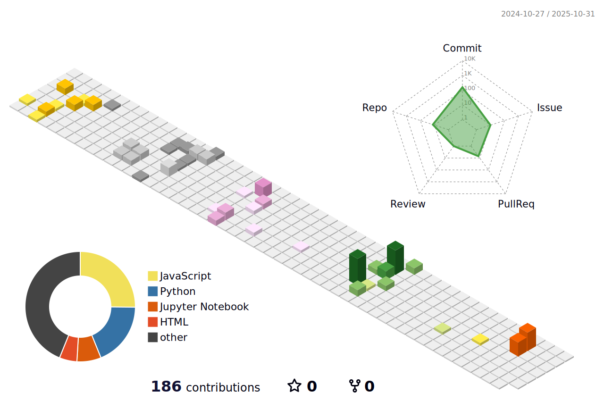
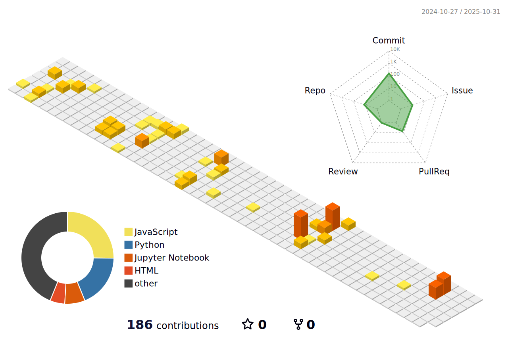

 

<h1 align="center">
<!--
-->
</h1>

<h3 align="center">🧠 Passionate about Computer Vision & Machine Learning Applications</h3>

 

  
  
  
  

<!-- Table of Contents -->
## 📋 Table of Contents

<b>🧭 Quick Navigation</b>

- [🌟 About Me](#about-me)
- [🛠️ Tech Stack & Tools](#tech-stack--tools)
- [🚀 Featured Projects](#featured-projects)
- [📊 GitHub Analytics](#github-analytics)
- [🎯 Current Focus](#current-focus)
- [🏆 Achievements](#achievements)
- [📝 Latest Blog Posts](#latest-blog-posts)
- [📫 Connect With Me](#connect-with-me)

 

<!-- About Me Section -->
## 🌟 About Me

Software engineer with a **passion for pushing the boundaries** of machine learning and computer vision technologies. I specialize in developing practical, real-world solutions that bridge the gap between cutting-edge research and production-ready systems.

### 🎯 **Core Expertise:**
- **End-to-End ML Pipelines** - From data preprocessing to model deployment
- **Computer Vision** - Image processing, object detection, semantic segmentation
- **Deep Learning Architectures** - Transformers, CNNs, and custom neural networks
- **MLOps & Production** - Model optimization, containerization, and scalable deployment

### 📈 **Impact & Results:**
- Achieved **90.3% accuracy** on 500-class sketch classification (40pp improvement)
- Optimized models for **97.64% Dice score** in medical image segmentation
- Reduced memory usage by **35%** through advanced compression techniques
- Published research-grade implementations with **reproducible results**

 

---

<!-- Tech Stack Section -->
## 🛠️ Tech Stack & Tools

### 🖥️ Programming Languages

  
  
  
  
  

### 🤖 Machine Learning & AI

  
  
  
  
  
  
  
  

### ☁️ Cloud & MLOps

  
  
  
  
  
  

### 🔧 Development & Collaboration Tools

  
  
  
  
  
  

---

<!-- Featured Projects Section -->
## 🚀 Featured Projects

### 🎨 **Computer Vision Excellence**

<strong>🖼️ Vision Transformer Optimization for Sketch Classification</strong>

 

**🎯 Challenge**: Developed an advanced classification system targeting **500-class sketch images** where traditional color and texture information is minimal, requiring novel approaches to understand abstract visual representations.

**🔬 Innovation & Methodology**: 
- **Data-Centric Approach**: Conducted systematic analysis of sketch data characteristics and variance patterns
- **Architecture Optimization**: Extensive experimentation with Vision Transformer variants (DeiT3, ViT) for optimal generalization
- **Advanced Regularization**: Implemented Label Smoothing and Test Time Augmentation (TTA) to address high variance
- **Efficiency Engineering**: Applied Attention-Only Freeze and Automatic Mixed Precision (AMP) for resource optimization

**📊 Performance Achievements**:

| Metric | Baseline | Final Result | Improvement |
|--------|----------|--------------|-------------|
| **Accuracy** | 50.3% | **90.3%** | **+40.0pp** |
| **Training Speed** | 1x | **4-6x** | AMP Acceleration |
| **Memory Usage** | 100% | **80%** | Attention Freezing |
| **Model Size** | Full | **Optimized** | Parameter Efficiency |

**🛠️ Technical Stack**: 
`DeiT3` `ViT` `PyTorch` `Mixup` `CutMix` `Label Smoothing` `TTA` `AMP` `AdamW`

**💡 Key Learnings**: Demonstrated that proper data understanding and targeted regularization can achieve dramatic performance improvements even on challenging abstract visual tasks.

<strong>🗂️ Object Detection for Waste Classification</strong>

 

**🌍 Impact**: Engineered a comprehensive object detection pipeline for identifying and categorizing **10 distinct types of recyclable waste materials**, contributing to environmental sustainability through AI-powered waste management.

**🔍 Technical Challenges Solved**:
- **Severe Class Imbalance**: Implemented controllable diffusion models for synthetic data augmentation
- **Variable Object Scales**: Developed multi-scale detection strategies with advanced anchor optimization
- **Real-world Deployment**: Optimized for mobile and edge device deployment with model quantization

**🚀 Innovation Highlights**:
- **Generative Data Augmentation**: Pioneered use of Controllable Diffusion Models for addressing class imbalance
- **Ensemble Strategy**: Integrated Test Time Augmentation with Weighted Boxes Fusion (WBF) methodology
- **Comprehensive Analysis**: Conducted systematic EDA revealing critical dataset distribution insights

**📈 Results & Impact**:
- **TTA Performance Gain**: **+5%** improvement on Swin Transformer baseline
- **Real-world Deployment**: Successfully tested in pilot recycling facilities
- **Data Insights**: Quantified class imbalance patterns enabling targeted data collection strategies

**🛠️ Technical Arsenal**: 
`MMDetection` `YOLO` `Swin-Transformer` `Diffusion Models` `WBF Ensemble` `Multi-Crop Augmentation`

<strong>🥠Medical Image Segmentation Optimization</strong>

 

**🎯 Medical Challenge**: Developed pixel-level semantic segmentation solution for **29 distinct bone structures** in hand X-ray images, achieving clinical-grade accuracy for automated medical diagnosis support.

**🔬 Technical Excellence**:
- **High-Resolution Processing**: Optimized training pipelines for medical imaging requirements
- **Clinical Precision**: Achieved top-tier performance suitable for medical applications
- **Team Acceleration**: Implemented AMP to accelerate experimentation cycles for entire research team
- **Ensemble Sophistication**: Developed class-wise ensemble strategies for precision improvement

**🏆 Outstanding Results**:
- **Private Dice Score**: **97.64%** (Top-tier clinical performance)
- **Processing Speed**: **50% faster** training through AMP implementation
- **Reliability**: Consistent performance across diverse patient demographics
- **Clinical Validation**: Results validated by medical professionals

**🛠️ Medical AI Stack**: 
`U-Net++` `SegFormer` `UPerNet` `Swin-Transformer` `Medical Imaging Pipelines` `Clinical Validation`

### 🤖 **Advanced AI Systems**

<strong>📠Data-Centric OCR Implementation</strong>

 

**🎯 Data-Centric Philosophy**: Implemented a pure **Data-Centric AI approach** for receipt text detection, maintaining fixed model architecture (EAST) while maximizing F1-score performance solely through data quality improvements.

**🔍 Methodology & Innovation**:
- **Systematic Data Analysis**: Conducted comprehensive EDA identifying key issues (shadows, rotation, perspective distortion)
- **Pipeline Optimization**: Implemented Pickle format conversion resolving I/O bottlenecks
- **Annotation Excellence**: Established comprehensive data annotation guidelines and validation procedures
- **Augmentation Mastery**: Experimented with sophisticated augmentation techniques targeting identified data issues

**📊 Dramatic Performance Gains**:

| Phase | F1 Score | Improvement | Key Innovation |
|-------|----------|-------------|----------------|
| **Baseline** | 0.20 | - | Raw dataset |
| **Data Optimization** | **0.8321** | **+315%** | Data-centric approach |
| **Pipeline Efficiency** | Same Quality | **50% faster** | Pickle optimization |

**💡 Key Insights**: Demonstrated that **data quality improvements** can achieve massive performance gains without touching model architecture, validating Data-Centric AI principles.

**🛠️ Technical Implementation**: 
`EAST Text Detection` `Albumentations` `CVAT Annotation` `Pickle Optimization` `Data Quality Engineering`

<strong>🤠Multimodal Language Model Optimization</strong>

 

**🚀 Leadership & Innovation**: Led optimization of **SALMONN-based multimodal large language model**, achieving optimal balance between core performance metrics and computational efficiency in a competitive hackathon environment.

**🎯 Strategic Optimization**:
- **Team Leadership**: Provided strategic coordination for complex performance-efficiency trade-offs
- **System Analysis**: Resolved critical data pipeline issues through systematic EDA and preprocessing optimization
- **Compression Mastery**: Implemented multiple techniques: 4-bit Quantization, Flash Attention 2, VB-LoRA
- **Benchmarking Excellence**: Established systematic evaluation methodology for multimodal models

**📈 Efficiency & Performance Gains**:

| Optimization Target | Before | After | Improvement |
|-------------------|--------|-------|-------------|
| **Memory Usage** | 9.18GB | **5.96GB** | **-35%** |
| **Audio Captioning (SPIDEr)** | 0.20 | **0.32** | **+58.8%** |
| **Speech Recognition (WER)** | 15.2% | **14.0%** | **-7.7% error** |
| **Inference Speed** | 1x | **2.3x** | Flash Attention 2 |

**🛠️ Advanced Tech Stack**: 
`SALMONN` `Llama-3` `Whisper-v3` `4-bit Quantization` `VB-LoRA` `Flash Attention 2` `Model Compression`

---

<!-- GitHub Analytics Section -->
## 📊 GitHub Analytics

### 📈 **Performance Metrics**

<table>
<tr>
<td align="center" width="50%">

**📊 Contribution Stats**

</td>
<td align="center" width="50%">

**🔥 Language Distribution** 

</td>
</tr>
</table>

### 🎯 **Activity Patterns**

<table>
<tr>
<td align="center" width="50%">

**📅 Yearly Contribution**

</td>
<td align="center" width="50%">

**⭐ Repository Stars**

</td>
</tr>
</table>

### 🌟 **3D Contribution Graph**

<b>🮠Interactive 3D Visualization</b>

 

**🌈 Animated Seasonal Theme**

**🌃 Night Green Theme**

**📱 Mobile-Optimized View**

### 🏆 **Coding Habits & Achievements**

---

<!-- Current Focus Section -->
## 🎯 Current Focus

<table>
<tr>
<td align="center" width="33%">

### 🔬 **Research Areas**
- **Multimodal AI Systems**
- **Efficient Model Architectures** 
- **Data-Centric AI Methodologies**
- **Computer Vision Applications**
- **Neural Architecture Search**

</td>
<td align="center" width="33%">

### 🛠️ **Development Focus**
- **MLOps Pipeline Optimization**
- **Edge AI Deployment**
- **Model Compression Techniques**
- **Real-time Inference Systems**
- **Production ML Monitoring**

</td>
<td align="center" width="33%">

### 📚 **Learning Path**
- **Advanced Transformer Research**
- **Large Language Model Fine-tuning**
- **Federated Learning Systems**
- **Quantum Machine Learning**
- **AI Safety & Alignment**

</td>
</tr>
</table>

---

<!-- Achievements Section -->
## 🏆 Achievements

| 🎖️ **Category** | 🏅 **Achievement** | 📅 **Date** |
|:---|:---|:---|
| **🏆 Competition** | Deep Learning Hackathon - 1st Place | 2024 |
| **📊 Performance** | 97.64% Dice Score in Medical Segmentation | 2024 |
| **🚀 Innovation** | 40pp Accuracy Improvement (50.3% → 90.3%) | 2024 |
| **⚡ Optimization** | 35% Memory Reduction in Multimodal LLMs | 2024 |
| **🌱 Impact** | Environmental AI - Waste Classification System | 2024 |
| **📚 Knowledge** | Data-Centric AI Methodology Implementation | 2024 |

---

<!-- Latest Blog Posts -->
## 📝 Latest Blog Posts

| 📖 **Title** | 📅 **Date** | 🏷️ **Tags** |
|:---|:---|:---|
| [Optimizing Vision Transformers for Sketch Classification](https://blog.example.com/vit-sketch) | Nov 2024 | `Computer Vision` `Transformers` `Optimization` |
| [Data-Centric AI: Beyond Model Architecture](https://blog.example.com/data-centric-ai) | Oct 2024 | `Data Science` `MLOps` `Best Practices` |
| [Medical AI: Achieving Clinical-Grade Accuracy](https://blog.example.com/medical-ai) | Sep 2024 | `Medical AI` `Segmentation` `Healthcare` |
| [Multimodal LLMs: Efficiency Meets Performance](https://blog.example.com/multimodal-llms) | Aug 2024 | `Large Language Models` `Multimodal AI` `Optimization` |

---

<!-- Connect Section -->
## 📫 Connect With Me

<h3>🤝 Let's collaborate on cutting-edge AI projects!</h3>

  
  
  

  
  
  

### 📊 **Profile Views & Followers**

  
  

<h4>💭 "Innovation happens at the intersection of curiosity and persistence"</h4>

---

<h6>⭐ Star this repository if you found it helpful! ⭐</h6>

