# Software Engineer

**Computer Vision & Machine Learning Specialist**

---

## About

Machine Learning Engineer focused on Computer Vision applications. Experienced in building end-to-end ML pipelines from research to production deployment.

**Core Expertise:** Deep Learning, Computer Vision, MLOps, Model Optimization

---

## Tech Stack

**Languages**
 

**ML/AI**
 

**DevOps**
 

---

## Featured Projects

### Vision Transformer for Sketch Classification

Advanced classification system for 500-class sketch images using Vision Transformers with data-centric optimization.

| Metric | Baseline | Final | Improvement |
|--------|----------|-------|-------------|
| **Accuracy** | 50.3% | **90.3%** | **+40.0pp** |
| **Training Speed** | 1x | **4-6x** | AMP Optimization |
| **Memory Usage** | 100% | **80%** | Attention Freezing |

**Tech:** `DeiT3` `ViT` `PyTorch` `Label Smoothing` `TTA` `AMP`

### Medical Image Segmentation

Pixel-level semantic segmentation for 29 bone structures in hand X-ray images.

| Metric | Result | Performance |
|--------|--------|-------------|
| **Dice Score** | **97.64%** | Clinical-grade accuracy |
| **Training Time** | **50% faster** | AMP implementation |
| **Reliability** | **Consistent** | Cross-patient validation |

**Tech:** `U-Net++` `SegFormer` `Swin-Transformer` `Medical AI`

### Object Detection for Waste Classification

Environmental AI system for identifying and categorizing 10 types of recyclable waste materials.

| Achievement | Impact | Technology |
|-------------|--------|------------|
| **+5% Performance** | TTA on Swin Transformer | Weighted Boxes Fusion |
| **Real Deployment** | Pilot recycling facilities | Edge optimization |
| **Data Innovation** | Diffusion model augmentation | Class imbalance solution |

**Tech:** `YOLO` `Swin-Transformer` `Diffusion Models` `WBF Ensemble`

### Data-Centric OCR

Pure data-centric approach for receipt text detection with fixed EAST architecture.

| Phase | F1 Score | Improvement | Innovation |
|-------|----------|-------------|------------|
| **Baseline** | 0.20 | - | Raw dataset |
| **Optimized** | **0.8321** | **+315%** | Data-centric AI |
| **Efficiency** | Same quality | **50% faster** | Pipeline optimization |

**Tech:** `EAST` `Data-Centric AI` `Albumentations` `Pipeline Optimization`

### Multimodal LLM Optimization

SALMONN-based multimodal large language model optimization for efficiency and performance balance.

| Optimization | Before | After | Improvement |
|-------------|--------|-------|-------------|
| **Memory Usage** | 9.18GB | **5.96GB** | **-35%** |
| **Audio Captioning** | 0.20 | **0.32** | **+58.8%** |
| **Speech Recognition** | 15.2% WER | **14.0%** | **-7.7% error** |

**Tech:** `SALMONN` `Llama-3` `4-bit Quantization` `Flash Attention 2` `VB-LoRA`

---

## GitHub Analytics

<table>
<tr>
<td align="center">

**Contribution Stats**
 

</td>
<td align="center">

**Language Distribution**
 

</td>
</tr>
</table>

**Contribution Calendar**
 

---

**Contact**

